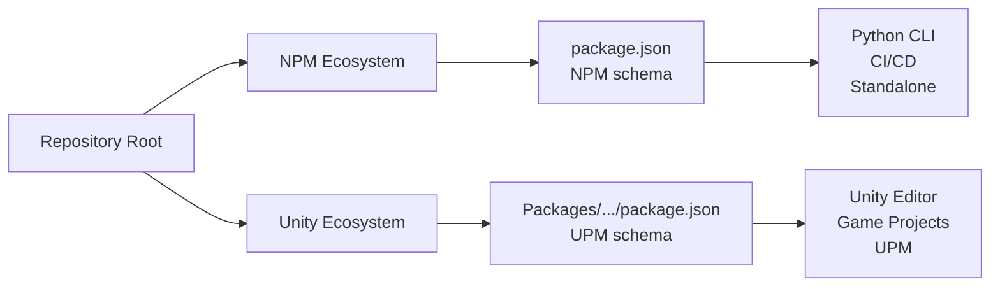

# Package.json Files Explained

This repository contains **two separate `package.json` files** for different package ecosystems:

## 1. NPM package.json (Root)

**Location:** `/package.json`

**Purpose:** Node.js/Python package metadata for CI/CD, tooling, and standalone validation

**Schema:** [NPM package.json specification](https://docs.npmjs.com/cli/v9/configuring-npm/package-json)

**Usage:**

```bash
# Run validation locally
npm run validate

# Generate report
npm run validate:report

# CI/CD validation (fails on violations)
npm run validate:ci
```

**Key Fields:**

- `name`: NPM-scoped package name (`@tinywalnutgames/storytest`)
- `main`: Entry point for Python CLI (`story_test.py`)
- `scripts`: NPM run scripts for validation workflows
- `engines`: Python/Node version requirements
- `devDependencies`: Development tooling dependencies

## 2. UPM package.json (Unity Package)

**Location:** `/Packages/com.tinywalnutgames.storytest/package.json`

**Purpose:** Unity Package Manager metadata for Unity Editor integration

**Schema:** [Unity package.json specification](https://docs.unity3d.com/Manual/upm-manifestPkg.html)

**Installation:**

```json
{
  "dependencies": {
    "com.tinywalnutgames.storytest": "https://github.com/jmeyer1980/TheStoryTest.git?path=Packages/com.tinywalnutgames.storytest"
  }
}
```

**Key Fields:**

- `name`: Unity reverse-DNS package name (`com.tinywalnutgames.storytest`)
- `displayName`: Human-readable name shown in Package Manager
- `unity`: Minimum Unity version (`2020.3`)
- `dependencies`: Unity package dependencies (empty - self-contained)
- `hideInEditor`: Controls visibility in Unity Package Manager UI

## Why Two Files?

### Different Ecosystems



### Schema Conflicts

| Field | NPM | UPM | Conflict? |
|-------|-----|-----|-----------|
| `name` | `@scope/package` | `com.company.package` | ✅ Different format |
| `version` | Semantic | Semantic | ✅ Same |
| `main` | Entry file | N/A | ❌ NPM-only |
| `displayName` | N/A | UI name | ❌ UPM-only |
| `unity` | N/A | Min version | ❌ UPM-only |
| `scripts` | NPM scripts | N/A | ❌ NPM-only |
| `dependencies` | NPM packages | Unity packages | ✅ Different registries |

### Installation Methods

**NPM (Python CLI):**

```bash
# Clone repository
git clone https://github.com/jmeyer1980/TheStoryTest.git
cd TheStoryTest

# Install Python dependencies
pip install -r requirements.txt

# Run validation
npm run validate
```

**UPM (Unity Package):**

```bash
# In Unity Package Manager
https://github.com/jmeyer1980/TheStoryTest.git?path=Packages/com.tinywalnutgames.storytest
```

## Dependency Management

### NPM package.json

**Current Dependencies:** None (Python-only, uses `requirements.txt`)

**Why no NPM dependencies?**

- Framework written in Python (`story_test.py`)
- Python dependencies managed via `requirements.txt`
- NPM scripts just wrap Python CLI

**If adding Node.js tooling:**

```json
{
  "devDependencies": {
    "eslint": "^8.0.0",
    "prettier": "^2.8.0"
  }
}
```

### UPM package.json

**Current Dependencies:** Empty `{}`

**Why no Unity dependencies?**

- Framework is **self-contained** and **Unity-agnostic**
- Uses only .NET Standard 2.0 APIs
- Runtime code has zero Unity dependencies
- Editor code uses Unity APIs but doesn't require packages
- Tests use NUnit (built into Unity)

**When to add dependencies:**

Only if the framework requires specific Unity packages. For example:

```json
{
  "dependencies": {
    "com.unity.test-framework": "1.1.33"
  }
}
```

⚠️ **Important:** Only add dependencies that exist in Unity 2020.3+ registry!

## CI/CD Integration

### GitHub Actions Workflow

The workflow uses **both** package.json files:

```yaml
# 1. Install Python deps (uses requirements.txt)
- name: Install Python Dependencies
  run: |
    pip install -r requirements.txt

# 2. Build Unity sample (uses UPM package.json)
- name: Build Sample Project
  uses: game-ci/unity-builder@v4
  with:
    projectPath: Samples~/ExampleProject  # Has UPM reference

# 3. Run validation (uses NPM scripts)
- name: Run Story Test
  run: npm run validate:ci
```

### Report Generation

**Expected Report Location:** `story-test-report.json` (root)

**Report Schema:**

```json
{
  "totalViolations": 0,
  "violationsByType": {
    "TodoComment": 0,
    "PlaceholderImplementation": 0
  },
  "violations": []
}
```

**Stub Report (for testing):**

```bash
# Create stub for CI testing
echo '{"totalViolations": 0, "violationsByType": {}, "violations": []}' > story-test-report.json
```

## Versioning Strategy

**Synchronized Versions:** Both package.json files use the **same version number**.

**Update Process:**

```bash
# 1. Update both package.json files
npm version patch  # Updates root package.json

# 2. Manually sync UPM package.json
# Edit Packages/com.tinywalnutgames.storytest/package.json
# Set "version": "1.0.1" (match NPM version)

# 3. Update CHANGELOG.md
# Document changes

# 4. Commit and tag
git add .
git commit -m "chore: Bump version to 1.0.1"
git tag v1.0.1
git push origin --tags
```

## Publishing

### NPM Registry (Future)

```bash
# Login to NPM
npm login

# Publish package
npm publish --access public
```

### Unity Package Manager (Current)

**Git URL Installation:** Already supported!

```
https://github.com/jmeyer1980/TheStoryTest.git?path=Packages/com.tinywalnutgames.storytest
```

**OpenUPM (Future):**

Submit to [OpenUPM Registry](https://openupm.com/packages/add/)

## Troubleshooting

### "Wrong package.json format"

**Symptom:** Unity shows errors or package doesn't appear

**Solution:** Ensure you're using the **UPM package.json** inside `Packages/com.tinywalnutgames.storytest/`

### "NPM scripts don't work"

**Symptom:** `npm run validate` fails

**Solution:** 

1. Ensure you have Python installed: `python --version`
2. Install dependencies: `pip install -r requirements.txt`
3. Check NPM package.json is at repository root

### "Dependency conflicts"

**Symptom:** Unity shows package dependency errors

**Solution:** UPM package.json should have **empty dependencies** `{}`

The framework is self-contained!

## See Also

- [NPM package.json docs](https://docs.npmjs.com/cli/v9/configuring-npm/package-json)
- [Unity package.json docs](https://docs.unity3d.com/Manual/upm-manifestPkg.html)
- [Semantic Versioning](https://semver.org/)
- [OpenUPM](https://openupm.com/)
