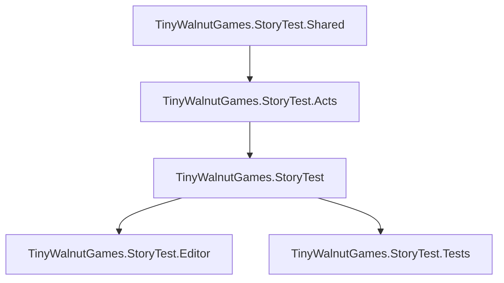

# Assembly Structure

## Overview

The Story Test Framework uses a modular assembly architecture with clean dependency separation:



## Assembly Definitions

### Shared Assembly

**Location:** `Runtime/Shared/TinyWalnutGames.StoryTest.Shared.asmdef`

**Purpose:** Foundation types with zero Unity dependencies

**Contains:**

- `StoryIgnoreAttribute` - Opt-out mechanism
- `StoryViolationShared` - Violation data structures
- `StoryTestSharedTypes` - Common enums and interfaces
- `ConceptualValidator` - Abstract validator base

**Dependencies:** None (pure .NET Standard 2.0)

### Acts Assembly

**Location:** `Runtime/Acts/TinyWalnutGames.StoryTest.Acts.asmdef`

**Purpose:** The 9 validation rule implementations

**Contains:**

- `Act1TodoComments.cs`
- `Act2PlaceholderImplementations.cs`
- `Act3IncompleteClasses.cs`
- `Act4UnsealedAbstractMembers.cs`
- `Act5DebugOnlyImplementations.cs`
- `Act6PhantomProps.cs`
- `Act7ColdMethods.cs`
- `Act8HollowEnums.cs`
- `Act9PrematureCelebrations.cs`

**Dependencies:**

```json
{
  "references": [
    "TinyWalnutGames.StoryTest.Shared"
  ]
}
```

### Main Assembly

**Location:** `Runtime/TinyWalnutGames.StoryTest.asmdef`

**Purpose:** Core validation orchestration

**Contains:**

- `StoryIntegrityValidator.cs` - Central validator
- `ProductionExcellenceStoryTest.cs` - MonoBehaviour wrapper
- `StoryTestRuleBootstrapper.cs` - Auto-registration
- `StoryTestUtilities.cs` - IL analysis helpers
- `StoryTestSyncPointValidator.cs` - Performance testing

**Dependencies:**

```json
{
  "references": [
    "TinyWalnutGames.StoryTest.Shared",
    "TinyWalnutGames.StoryTest.Acts"
  ]
}
```

### Editor Assembly

**Location:** `Editor/TinyWalnutGames.StoryTest.Editor.asmdef`

**Purpose:** Unity Editor integrations

**Contains:**

- `StoryTestExportMenu.cs` - Menu item for validation
- `StrengtheningValidationSuite.cs` - Additional checks

**Dependencies:**

```json
{
  "references": [
    "TinyWalnutGames.StoryTest",
    "TinyWalnutGames.StoryTest.Shared",
    "TinyWalnutGames.StoryTest.Acts"
  ],
  "includePlatforms": [
    "Editor"
  ]
}
```

### Tests Assembly

**Location:** `Tests/TinyWalnutGames.StoryTest.Tests.asmdef`

**Purpose:** NUnit test suite

**Contains:**

- `StoryTestValidationTests.cs` - Unit tests for all Acts

**Dependencies:**

```json
{
  "references": [
    "UnityEngine.TestRunner",
    "UnityEditor.TestRunner",
    "TinyWalnutGames.StoryTest",
    "TinyWalnutGames.StoryTest.Shared",
    "TinyWalnutGames.StoryTest.Acts"
  ],
  "includePlatforms": [],
  "excludePlatforms": []
}
```

## Dependency Flow

### Clean Architecture Principles

```ts
┌─────────────────────────────────────┐
│   Editor Assembly (Unity Editor)   │
│   - Menu integrations               │
│   - Additional validation           │
└─────────────────────────────────────┘
              │
              ▼
┌─────────────────────────────────────┐
│   Main Assembly (Runtime)           │
│   - Validator orchestration         │
│   - MonoBehaviour wrapper           │
│   - IL utilities                    │
└─────────────────────────────────────┘
              │
              ▼
┌─────────────────────────────────────┐
│   Acts Assembly (Validation Rules)  │
│   - 9 validation rules              │
│   - IL bytecode analysis            │
└─────────────────────────────────────┘
              │
              ▼
┌─────────────────────────────────────┐
│   Shared Assembly (Foundation)      │
│   - StoryIgnoreAttribute            │
│   - Violation types                 │
│   - Zero dependencies               │
└─────────────────────────────────────┘
```

## Rule Registration

### Automatic Discovery

```csharp
// StoryTestRuleBootstrapper.cs
[InitializeOnLoad]
public static class StoryTestRuleBootstrapper {
    static StoryTestRuleBootstrapper() {
        var actsAssembly = Assembly.Load("TinyWalnutGames.StoryTest.Acts");
        
        foreach (var type in actsAssembly.GetTypes()) {
            var ruleField = type.GetField("Rule", BindingFlags.Public | BindingFlags.Static);
            if (ruleField?.FieldType == typeof(ValidationRule)) {
                var rule = (ValidationRule)ruleField.GetValue(null);
                StoryIntegrityValidator.RegisterRule(rule);
            }
        }
    }
}
```

### Manual Registration

```csharp
// Custom rules can be registered manually
StoryIntegrityValidator.RegisterRule(MyCustomRule.Rule);
```

## Unity-Agnostic Design

### Conditional Compilation

```csharp
#if UNITY_EDITOR || UNITY_ENGINE
using Debug = UnityEngine.Debug;
#else
using Debug = System.Diagnostics.Debug;
#endif
```

### Standalone Usage

The Shared and Acts assemblies have **zero Unity dependencies**, enabling:

- Python CLI validation via `story_test.py`
- CI/CD integration without Unity runtime
- .NET Core console applications
- Azure Functions validation

## Testing Strategy

### Unit Tests

```csharp
[TestFixture]
public class StoryTestValidationTests {
    [Test]
    public void Act1_DetectsNotImplementedException() {
        // Test Act 1 validation
        var violations = Act1TodoComments.Rule(typeof(TestClass));
        Assert.IsNotEmpty(violations);
    }
    
    [Test]
    public void StoryIgnore_SkipsValidation() {
        // Test StoryIgnore attribute
        var violations = Act1TodoComments.Rule(typeof(IgnoredClass));
        Assert.IsEmpty(violations);
    }
}
```

### Integration Tests

```csharp
[Test]
public void ValidateAssemblies_FindsAllViolations() {
    var validator = new StoryIntegrityValidator();
    var assembly = Assembly.Load("Assembly-CSharp");
    
    var violations = validator.ValidateAssemblies(new[] { assembly });
    
    // Verify all Acts executed
    Assert.That(violations, Has.Some.Matches<StoryViolation>(v => v.ActNumber == 1));
    Assert.That(violations, Has.Some.Matches<StoryViolation>(v => v.ActNumber == 9));
}
```

## Extending the Framework

### Adding New Acts

1) Create `ActXYourRule.cs` in `Runtime/Acts/`
2) Implement `ValidationRule` delegate:

    ```csharp
        namespace TinyWalnutGames.StoryTest.Acts {
        public static class Act10YourRule {
            public static readonly ValidationRule Rule = ValidateYourRule;

            private static List<StoryViolation> ValidateYourRule(Type type) {
                var violations = new List<StoryViolation>();
                
                // Your validation logic
                if (HasViolation(type)) {
                    violations.Add(new StoryViolation {
                        ActNumber = 10,
                        ViolationType = StoryViolationType.YourRuleType,
                        Message = "Your rule violation message",
                        Location = type.FullName
                    });
                }
                
                return violations;
            }
        }
    }
    ```

3) The `StoryTestRuleBootstrapper` auto-discovers it on Editor load

### Adding Violation Types

Update `StoryViolationShared.cs`:

```csharp
public enum StoryViolationType {
    // Existing types...
    TodoComment,
    PlaceholderImplementation,
    // ... more ...
    
    // Your new type
    YourRuleType
}
```

## Performance Considerations

### Lazy Loading

Acts are loaded lazily via reflection, minimizing startup time.

### Parallel Validation

```csharp
// StoryTestSyncPointValidator.cs uses parallel validation
var violations = new ConcurrentBag<StoryViolation>();

Parallel.ForEach(assemblies, assembly => {
    var results = validator.ValidateAssemblies(new[] { assembly });
    foreach (var v in results) violations.Add(v);
});
```

### Assembly Caching

Validators cache assembly metadata to avoid repeated reflection.

## See Also

- [Quick Start Guide](QuickStart.md)
- [Dynamic Validation](DynamicValidation.md)
- [Package README](../README.md)
